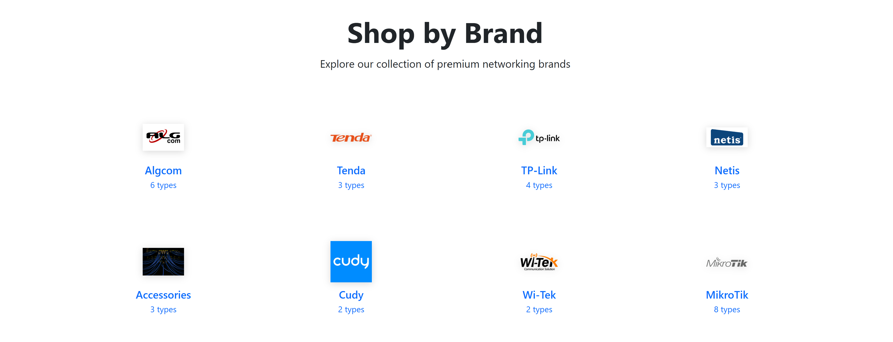
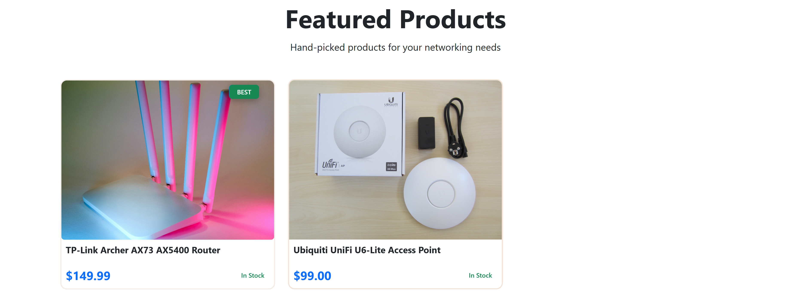
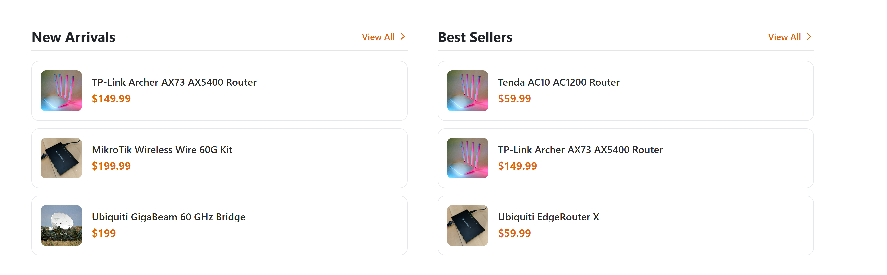
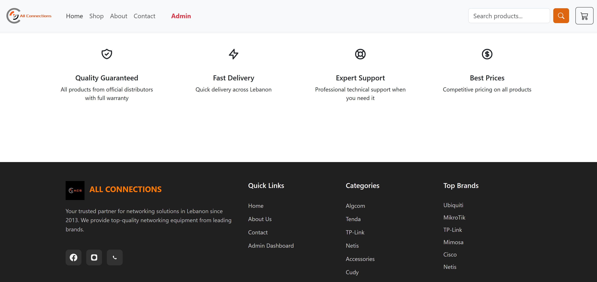
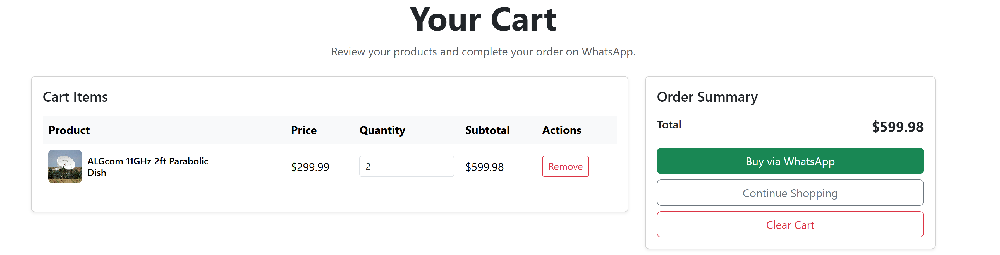
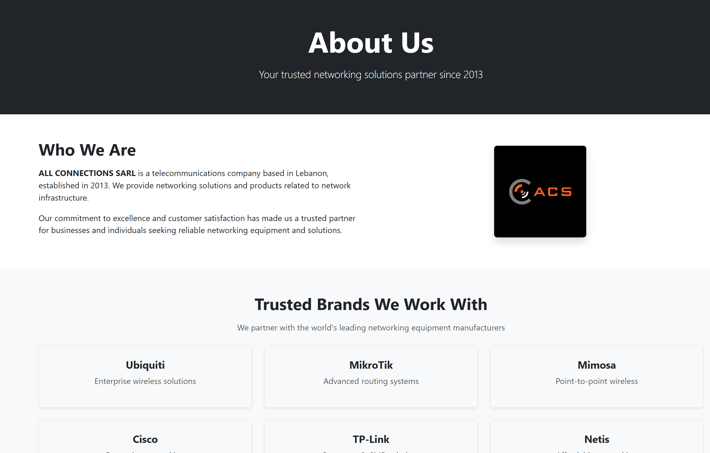
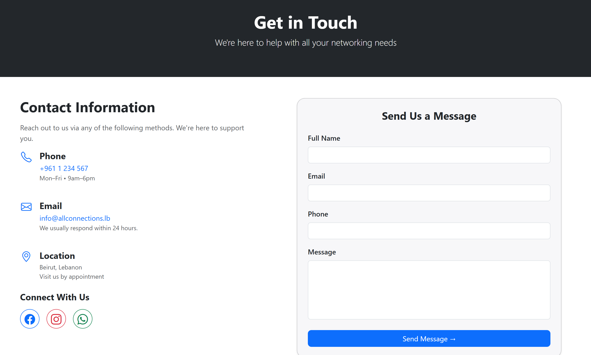

# All Connections – Networking Store (React Project)

This project is a frontend website built using React and Bootstrap.  
It is an online store for networking products such as routers, access points, antennas, and switches. The goal is to show UI, page navigation, filtering, and a small cart system using **static data only** with **no backend**.

The website includes 7 pages (Home, Shop, Product Details, About, Contact, Cart, Admin login)

---

## Features

### **Home Page**
- Hero banner and CTA buttons  
- brands and categories  
- Featured products  
- Logos and trust section  

### **Shop Page**
- Filter by brand  
- Filter by product subcategory  
- Sort by name or price  
- Product grid layout  


### **Product Details Page**
- Large product image  
- Specifications box  
- Quantity selector  
- Add to cart  

### **Cart Page**
- View cart items  
- Update quantities  
- Remove items  
- Clear cart  

### **Admin Page**
- Simple static login for demo

### **Search Feature**
- Search bar integrated in the navbar  
- Displays matched products from static data  

### **Static Data**
- All products and categories are stored locally  
- no API calls  

---

## Technologies Used

- **React** (Create React App)
- **React Router DOM** (page routing)
- **Bootstrap 5** + **Bootstrap Icons**  
- **React Context** for cart state
- **Custom CSS files** for stylistic sections

---

## Setup Instructions

1. **Node.js** instal
2. Download or clone this repository.
3. Install the required packages:
   ```bash
   npm install
4. Start the Dev Server:
   ```bash
   npm start
5. Open the project in your browser at:
    [text](http://localhost:3000)


## UI

### Home Page






### Shop Page


### Product Details


### Cart Page


### About Page


### Contact Page


### Admin Page

